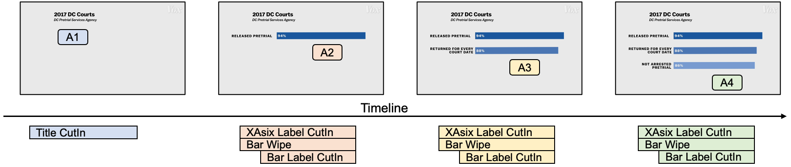

- [Task 1: Get Started](#task-1-get-started)
  - [Create without Template](#create-without-template)
    - [Step 1: Create A1](#step-1-create-a1)
    - [Step 2: Create A2](#step-2-create-a2)
    - [Step 3: Copy and Paste to Create A3/A4](#step-3-copy-and-paste-to-create-a3a4)
    - [Step 4: Align with the Narration](#step-4-align-with-the-narration)
    - [Problem](#problem)
  - [Create with Reusable Template](#create-with-reusable-template)
    - [Step 1: Create Template](#step-1-create-template)
    - [Step 2: Use Template](#step-2-use-template)
  - [Explore](#explore)
    - [Use `nth-child` and Template with Number Parameter](#use-nth-child-and-template-with-number-parameter)
    - [Use `stagger`](#use-stagger)


# Task 1: Get Started

In this task, we will use *Gaia* to reproduce a [real example](https://youtu.be/5mhwDSHKEyM?t=215) of animated infographics. 
We have already prepared the SVG with data binding, narration text and the corresponding audio.



```
In 2017, 94% of defendants were released pretrial, 88% of those returned for every single court date, 86% weren't arrested during that time.
```

In this example, we have 4 animations (A1-A4). The creation process is progressive. You can stop, play and refine at any time.

## Create without Template

Start with an empty *Gaia* animation spec. The top-level animation is usually a `Sync` *AniUnit*, which contains several animations that are played simultaneously.

```json5
{
  "main": {
    "sync": []
  }
}
```

### Step 1: Create A1

At the beginning, the title is shown with a `CutIn` effect.

```json5
{
  "main": {
    "sync": [
      {
        "ref": "CutIn",
        "target": ".Title",
      }
    ]
  }
}
```

The effect is applied to each group in the collection. Here we can find that all title texts are animated as a group.
We can change the target to `.Title text` to generate a selection which is a collection of title and sub-title.
Besides, we can set the `ease` to control the easing function.

```json5
{
  "ref": "CutIn",
  "target": ".Title text",
  "ease": "power3.out"
}
```

```
TASK 1.1: Create A1
```

### Step 2: Create A2

A2 contains 3 animations. Here we need to select the bar, axis label and bar label at the top. 
You can use any transform to select them, for example:
- `selectAll` with CSS selector
- `at` to pick the group by indices
- `filter` with a predicate expression.

Hint: data is bound to the elements. You can visit them by `[dataName="<value>"]` in CSS selector or `@data` in expressions.

```
TASK 1.2: Create A2 with proper selection
```

### Step 3: Copy and Paste to Create A3/A4

We can copy the spec of A2 and change the target to create A3 and A4 as they are similar. The `target` should be changed.

```
TASK 1.3: Create A3 and A4 with proper selection
```

### Step 4: Align with the Narration

We have declared 10 *AniUnits*. Except for the first one, other animations in A2-4 need to set `offset`.
You can use the audio and refer to the timeline shown at the beginning of this tutorial.

```
TASK 1.4: Align with the narration
```

### Problem

*Gaia* uses *AniUnit* to represent animations, which is intuitive and concise compared to keyframes, and provides an expressive selection mechanism.

Even with these features, it's not an easy task to create this simple animation.
In step 4, we need to manually specify the offsets of each animation and pay attention to the alignment in each animation group.
It will be more difficult if we want to modify and refine the animation.
For example, if we want to uniformly change the effect `Wipe` for bars in A2-4, we need to modify the spec 3 times.


## Create with Reusable Template

As we can see, sometimes the animations share similarities. *Gaia* allows us to create an *AniClass* as a template and then reuse it to simplify the animation creation.
The template specs share the same grammar as the animation specs.

In this example, we can create a template for A2-A4. 

### Step 1: Create Template

First, we create a new *AniClass* named `ShowCategory` as a template to implement A2-A4.

```json5
{
  "name": "ShowCategory",
  "main": { ... }
}
```

However, we want to select elements for different categories. 
We can define a string parameter named `category` and refer to it by `$category`.
Then combined with transform operators, the desired selection can be achieved by giving different parameters.

Besides, we want the offset of the last animation to be customizable. So we can define a number parameter named `barLabelOffset` with a default value `1`.

```
TASK 2.1: Create a template with two parameters
```

### Step 2: Use Template

Next, in the top-level *AniClass*, we can use the `ref` attribute to reuse it.
With passing `category` param, A2-4 can be created simply.
With other parameters, we can also customize the template. For example, we set the `barLabelOffset` to `1.5` for A1.

```
TASK 2.2: Rewrite animation spec using the template
```

This time, we don't need to care about the alignment in each animation group, and the refinement is also easier by modifying the template.

## Explore

*Gaia* is designed to be flexible and expressive. There are several alternatives to create this animation. Here we provide some ideas.

### Use `nth-child` and Template with Number Parameter

```json5
// in the template
{
  "params": {
    "nth": { "type": "number" }
  },
  ...
  "target": ".Bar rect:nth-child($nth)",
  ...
}
// in the top-level spec
...
{
  "ref": "ShowCategory",
  "nth": 0,
  "offset": 2
}
```

### Use `stagger`

Due to the narration, the time offset between A2-4 is the same. So we can implement it with `stagger`.

```json5
// declaring wipe-in animations of all bars
{
  "ref": "Wipe",
  "target": ".Bar rect",
  "from": "left",
  "offset": 2,
  "stagger": 3,
}
```

Notice that although this spec is concise, it lacks the capability to control the animation of each category.
It might not work if the narration is changed.

