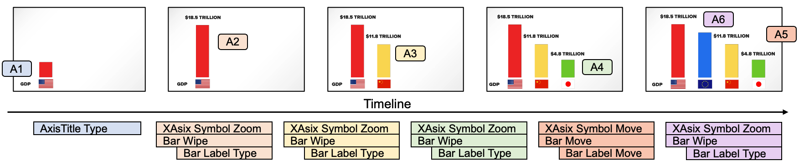

- [Task 2: Contribute Templates](#task-2-contribute-templates)
  - [Create Template](#create-template)
    - [Step 1: Declare Target Type](#step-1-declare-target-type)
    - [Step 2: Add *AniUnit*](#step-2-add-aniunit)
    - [Step 3: Add Parameters](#step-3-add-parameters)
  - [Use Template](#use-template)
    - [Step 1: Apply Template](#step-1-apply-template)
    - [Step 2: Add More Details](#step-2-add-more-details)
    - [Step 3: Fine-tune Animation](#step-3-fine-tune-animation)
  - [Explore](#explore)


# Task 2: Contribute Templates

In the last task, we reproduce of animated infographics, creating a template to animate the bar, bar label, and axis label as a group.
In *Gaia*, animation design for a group (including effects and timing for each element) can be reused not only in the same infographic but also in other infographics.

This is because *Gaia* uses a **virtual target model** for target selection, so the declaration of `target` works regardless of the actual SVG structure. 
The DOM structure used in selecting is consistent in different infographics, as long as they are declared to be of the same type.

Now let's try to make this template more general and contribute it as a template for all bar charts.
This template can be shared with others and reuse it in another infographic.

## Create Template

### Step 1: Declare Target Type

Start with the `ShowCateogy` template in the last tutorial, we add `"targetType": "BarChart"` to declare the type of the targeted animation instance for this template.

Then the group transferred to this template is specified as `BarChart`.
Hence, the creation of templates can be done without relying on a real infographic instance.
We can know there are `Bar`, `BarLabel`, `AxisLabel` and `AxisSymbol` in the group (which is declared by designers with target type specs).

```
TASK 1.1: Declare Target Type
```

### Step 2: Add *AniUnit*

There are other elements that we hope to animate together, such as `AxisSymbol`. Now we design animations for them by adding *AniUnits*.

```json5
{
  "ref": "Zoom",
  "target": ".AxisSymbol > *[xVal=$category]",    // here we use "> *" because symbol might be a group that contains multiple elements
},
```

If the selection is empty, the animation will be skipped.

```
TASK 1.2: Add AniUnit
```

### Step 3: Add Parameters

We can add more parameters to make the template more customizable.
Here, we set the effect type of text as parameters (with a default value `Cut`), then expose the `from` parameter of `Wipe`.
Now we finish the declaration of the template with 4 parameters.

```
TASK 1.3: Finish the template with 4 parameters
```

## Use Template

After registering it to *Gaia*'s library, anyone can use this template in all infographics (including the instance in tutorial 1).
Here we try to use it to reproduce a [real animation](https://youtu.be/eBV4GmK4kO4?t=33).

The static SVG with data, the narration (shown below) and audio are provided.



```
The USA has the world's highest GDP of around 18.5 trillion dollars. It's followed by China with a nominal GDP of 11.8 trillion dollars, and then Japan with a GDP of around 4.8 trillion dollars. The European Union would take second place, but the EU is a combination of 28 states.
```

### Step 1: Apply Template

In the empty animation spec, insert 4 *AniUnits* using the template `ShowCateogy`.
Then place them to corresponding times according to the narration.
Remember that you can play and evaluate animations at any time.

```
TASK 2.1: Create animations with the template
```

### Step 2: Add More Details

We next add two *AniUnits*: `Type` and `MoveFrom`. They are placed at the beginning and before the last category enters, respectively.

```
TASK 2.2: Add more animations
```

### Step 3: Fine-tune Animation

To better reproduce the original animation, we can use the parameters we designed to replace the effect of texts with `Type`.
But if you want to explore the animation settings, it is recommended to use `params` as a place for local variable definition to ease the refinement.

```
TASK 2.3: Fine-tune and finish the animation
```

## Explore

You can still explore other effects and settings to improve the animation.
Remember that using params as local constants can make refinement easier.

