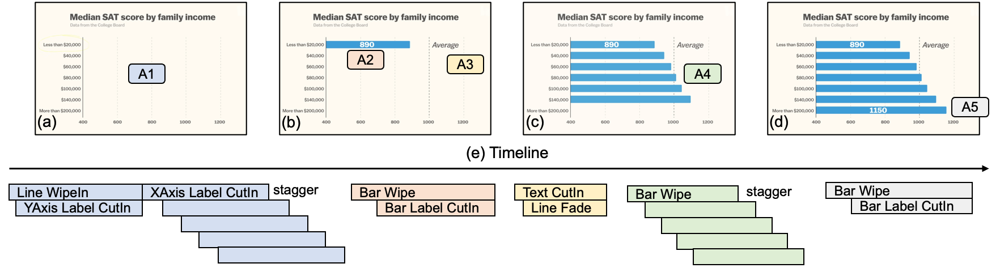

- [Task 3: Reproduction Test](#task-3-reproduction-test)


# Task 3: Reproduction Test

In this task, we try to use *Gaia* to reproduce a [real animation](https://youtu.be/WjVVwMGJ9S8?t=334) **without** step-by-step instructions。

The static SVG with data, the narration (shown below) and the audio are provided.



```
Here's a chart of the average SAT scores by family income. Students whose families earn less than $20,000 score around 890. way below average. And as we move up the income brackets, students score higher and higher. The wealthiest students -- whose parents earn more than $200,000. score an average of 1150.
```

```
TASK 1: Reproduce the animation
```

After that, you can explore other effects and settings to improve the animation.
You don't need to follow the original animation exactly.
Remember that using params as local constants can make refinement easier.

```
TASK 2: Refine the animation
```
