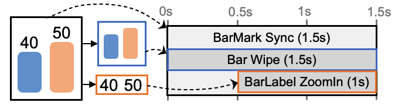
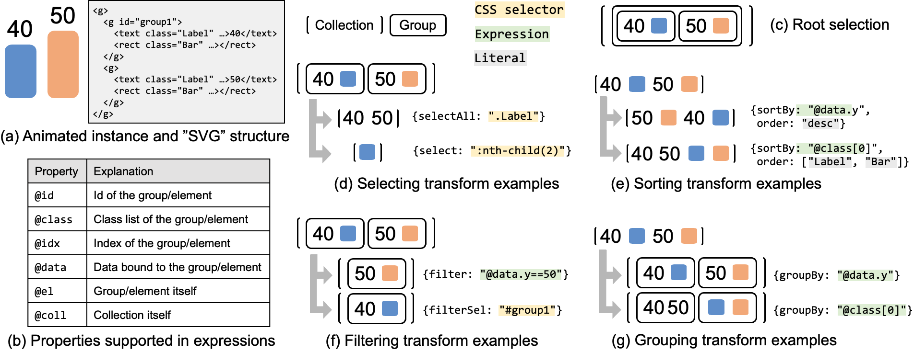

- [Tutorial 0: Basic Concepts](#tutorial-0-basic-concepts)
  - [The Basics](#the-basics)
    - [AniClass and AniUnit](#aniclass-and-aniunit)
    - [Attributes](#attributes)
  - [Target Selection](#target-selection)
  - [Parameter Abstraction](#parameter-abstraction)
  - [Data Binding](#data-binding)
  - [Animation Library](#animation-library)
    - [Fade \& Zoom](#fade--zoom)
    - [Wipe \& Grow \& Cut](#wipe--grow--cut)
    - [ChangeColor](#changecolor)
    - [MoveFrom \& MoveTo](#movefrom--moveto)
    - [Wheel](#wheel)
    - [Type](#type)
    - [Circle](#circle)
    - [Custom](#custom)

# Tutorial 0: Basic Concepts

*Gaia* is a declarative language for animated infographics.
In this tutorial, we will introduce the basic concepts
of *Gaia*.
At the end of the tutorial, we provide a list of animation templates that are commonly used.

## The Basics

### AniClass and AniUnit

In *Gaia*, one animation spec (as we call *AniClass*) describes the animation applied to a given infographic.
Each *AniClass* contains several animation units (as we call *AniUnit*) and a set of settings.
Here is an example.

```json5
// an example of AniClass (JSON5 file)
{
  "params": {
    "direction": "bottom"
  },
  // AniUnit Sync, which contains two children starting at the same time
  "main": {
    "sync": [
      // AniUnit Wipe
      {
        "ref": "Wipe",      // A reference to the Wipe template animation
        "target": ".Bar",   // A CSS selector that picks elements from the parent AniUnit
        "from": "$direction",
        "duration": 1.5,    // default duration is 1
      },
      // AniUnit Zoom
      {
        "ref": "Zoom",
        "target": ".BarLabel",
        "offset": 0.5,    // start time offset
      }
    ]
  }
}
```

Attribute `main` is an *AniUnit*, which is the body of the animation.
Attribute `params` declares a parameter named `direction` and can be referred by `$direction`.
This spec creates an animation shown in the following figure.



 *AniUnit* is the minimal unit of animation in *Gaia*.
It can form a tree structure by nesting other *AniUnit*.
In this example, `main` declares an  *AniUnit* named `Sync` and it contains two children: `Wipe` and `Zoom`.

### Attributes

An internal *AniUnit* can use `sync` or `concat` to combine multiple animations.
The leaf animation uses a `ref` attribute to refer to a template animation.
The targeted element is specified by `target` attribute, which is a CSS selector that works similarly to the `selectAll` in
D3.
Other attributes specify the timing and effect parameters of the animation.

<style type="text/css">
.tg  {border-collapse:collapse;border-spacing:0;}
.tg td{border-color:black;border-style:solid;border-width:1px;font-family:Arial, sans-serif;font-size:14px;
  overflow:hidden;padding:10px 5px;word-break:normal;}
.tg th{border-color:black;border-style:solid;border-width:1px;font-family:Arial, sans-serif;font-size:14px;
  font-weight:normal;overflow:hidden;padding:10px 5px;word-break:normal;}
.tg .tg-lboi{border-color:inherit;text-align:left;vertical-align:middle}
</style>
<table class="tg">
<thead>
  <tr>
    <th class="tg-lboi">Type</th>
    <th class="tg-lboi">Attribute</th>
    <th class="tg-lboi">Example(s)</th>
    <th class="tg-lboi">Default</th>
  </tr>
</thead>
<tbody>
  <tr>
    <td class="tg-lboi">Target</td>
    <td class="tg-lboi">target</td>
    <td class="tg-lboi">"Bar" / [{"selectAll": ".Bar"}] / "$var"</td>
    <td class="tg-lboi">[]</td>
  </tr>
  <tr>
    <td class="tg-lboi" rowspan="4">Timing</td>
    <td class="tg-lboi">duration</td>
    <td class="tg-lboi" rowspan="2">2.0 / "$var"</td>
    <td class="tg-lboi">1</td>
  </tr>
  <tr>
    <td class="tg-lboi">offset</td>
    <td class="tg-lboi">0</td>
  </tr>
  <tr>
    <td class="tg-lboi">stagger</td>
    <td class="tg-lboi">0.2 / “$var” / {"start": "after", "value": 0.2}</td>
    <td class="tg-lboi">0</td>
  </tr>
  <tr>
    <td class="tg-lboi">yoyo</td>
    <td class="tg-lboi">true / {"repeat": 1, "delay": 0.2} / "$var"</td>
    <td class="tg-lboi">false</td>
  </tr>
  <tr>
    <td class="tg-lboi" rowspan="4">Effect</td>
    <td class="tg-lboi">sync</td>
    <td class="tg-lboi" rowspan="2">[{"target": ".Bar", "ref": "FadeIn"}]</td>
    <td class="tg-lboi"></td>
  </tr>
  <tr>
    <td class="tg-lboi">concat</td>
    <td class="tg-lboi"></td>
  </tr>
  <tr>
    <td class="tg-lboi">ref</td>
    <td class="tg-lboi">"Wipe" / "$var"</td>
    <td class="tg-lboi"></td>
  </tr>
  <tr>
    <td class="tg-lboi">(other params)</td>
    <td class="tg-lboi">"from": "bottom"  / "param": "$var"</td>
    <td class="tg-lboi"></td>
  </tr>
</tbody>
</table>

<!-- | Type     | Attribute      | Example(s)                                      | Default |
|----------|----------------|-------------------------------------------------|---------|
| Target   | target         | "Bar" / [{"selectAll": ".Bar"}] / "$var"        | []      |
| Timing   | duration       | 2.0 / "$var"                                    | 1       |
| Timing   | offset         | (same as duration)                              | 0       |
| Timing   | stagger        | 0.2 / “$var” / {"start": "after", "value": 0.2} | 0       |
| Timing   | yoyo           | true / {"repeat": 1, "delay": 0.2} / "$var"     | false   |
| Effect   | sync           | [{"target": ".Bar", "ref": "FadeIn"}] / "$var"  |         |
| Effect   | concat         | (same as sync)                                  |         |
| Effect   | ref            | "Wipe" / "$var"                                 |         |
| Effect   | (other params) | "from": "bottom"  / "param": "$var"             |         | -->

## Target Selection

Similar to D3, the *Selection* in *Gaia* is a collection of groups.
The `target` attribute declares how the current _AniUnit_ selects the target elements **from its parent**.
It is a list of *Transform* objects functioning as a pipeline.
The *Transform* object can be one of the following types:

| Type      | Grammar                                      |
|-----------|----------------------------------------------|
| select    | { select: "\<css selector>" }                 |
| selectAll | { selectAll: "\<css selector>" }              |
| filter      | { filter: "\<boolean expression>" } |
| filterSel      | { filter: "\<css selector>" } |
| sort      | { sortBy: "\<key expression>", order: "asc" \| "desc" \| \<value list> } |
| group     | { groupBy: "\<key expression>" }              |
| slice     | { slice: [\<start>, \<end>?, \<step>?] }                | 
| at        | { at: \<index> }       | 

The spec below selects all elements (from the bar group) with positive yVal values, sorting them by their x values in descending order and then picking the first 10 elements.
```json5
"target": [
  { "selectAll": ".Bar > *" },
  { "filter": "@data.yVal > 0" },
  { "sort": { "sortBy": "@data.xVal", "order": "desc" } },
  { "slice": [0, 10] }
]
```
Besides, these three specs are equivalent.
```json5
"target": ".Bar"
"target": { "selectAll": ".Bar" }   // single transform can be other types
"target": [{ "selectAll": ".Bar" }]
```

This figure shows some concrete examples of the target selection.



Notice that the properties mounted on the group/element can be visited in the expressions via the alias shown in (b).

## Parameter Abstraction

*Gaia* allows users to declare parameters.
They can be used as a local constant or function as an interface for a template.
Here are some examples:
  
```json5
"params": {
  "offset": {
    "type": "number",
  },
  "textEffect": "Fade",
  // short for
  // "textEffect": {
  //   "type": "string",
  //   "value": "Fade"
  // },
  "myValue": { 
    "type": "string",   // for a template, the parameter is required if not set a default value
  },
}
...
{
  "ref": "$textEffect",
  "target": [
    { "selectAll": ".AxisLabel text" },
    { "filter": "@data.xVal == $myValue" },   // $myValue will be replaced with "<param value>" in the expression or CSS selector
  ],
  "offset": "$offset"
}
```

*Gaia* will check the type and value of parameters when applying the template.

## Data Binding

*Gaia* can bind the data to mark elements, which can be used in the target selection.
You can find the data in the binder spec.
An example is shown below.

```json line
// bind to the corresponding bar, bar label and x-axis label
{ "xVal": "RELEASED PRETRIAL", "yVal": 0.94 },
{ "xVal": "RETURNED FOR EVERY COURT DATE", "yVal": 0.88 },
{ "xVal": "NOT ARRESTED PRETRIAL", "yVal": 0.86 }
```

They are mounted to the attributes of the SVG elements and can be used in CSS selectors (e.g., `[xVal="RELEASED PRETRIAL"]`).
When using expressions, they can also be accessed by `@data` (e.g., `@data.xVal`).

## Animation Library

*Gaia* provided a variety of animation templates.
You can find the full list and corresponding declaration of parameters in the folder `src/preset/template`.
Some basic animations are listed here.

### Fade & Zoom
| Parameter | Valid Values | Default        |
|-----------|--------------|----------------|
| type      | "in", "out"  | "in"           |
| ease      | (see below)  | "power1.inOut" |

Parameter `ease` can be one of the following values:
```typescript
"power2.in" | "power3.out" | "power4.inOut" | "back" | "elastic" | "bounce"
```
For the values starting with `power`, the number indicates the power of the ease function and the suffix can be one of `in`, `out`, or `inOut`.

### Wipe & Grow & Cut
| Parameter | Valid Values                     | Default        |
|-----------|----------------------------------|----------------|
| type      | "in", "out"                      | "in"           |
| from      | "top", "bottom", "left", "right" | "bottom"       |
| ease      | (same as Fade)                   | "power1.inOut" |

### ChangeColor
| Parameter | Valid Values     | Default        |
|-----------|------------------|----------------|
| type      | "from", "to"     | "to"           |
| fill      | "#112233", "red" | "#ff0000"      |
| ease      | (same as Fade)   | "power1.inOut" |

### MoveFrom & MoveTo
| Parameter | Valid Values                   | Default        |
|-----------|--------------------------------|----------------|
| x         | 20, "+=10", "+=10px", "-=100%" | null           |
| y         | (same as x)                    | null           |
| ease      | (same as Fade)                 | "power1.inOut" |

For `x` and `y`, the value can be a number (absolute position), a string with `+=` or `-=` prefix (relative position in pixels), or a string with `%` suffix (relative position in percentage).

### Wheel
| Parameter | Valid Values                     | Default        |
|-----------|----------------------------------|----------------|
| type      | "in", "out"                      | "in"           |
| startAngle| 0, 90, 180, 270, etc.            | 0              |
| sweepAngle| 90, 180, 270, etc.               | 360            |
| ease      | (same as Fade)                   | "power1.inOut" |

This animation can be used on any SVG element.

### Type
| Parameter   | Valid Values                     | Default        |
|-------------|----------------------------------|----------------|
| type        | "in", "out"                      | "in"    |
| effect      | "fade", "show"                   | "show"         |
| typeStagger | 0.1, 0.2 etc.                    | 0.1            |
| ease        | (same as Fade)                   | "power1.inOut" |

This animation only works on text elements. It types the text letter by letter with a given stagger.

### Circle
| Parameter   | Valid Values                     | Default        |
|-------------|----------------------------------|----------------|
| direction   | "clockwise", "counter-clockwise" | "clockwise"    |
| aniTime     | 1.0, 2.0, etc.                   | 1.0            |
| displayTime | 1.0, 2.0, etc.                   | 3.0            |
| stroke      | "#112233", "red"                 | "#ff6868"      |
| strokeWidth | 1, 2, etc.                       | 3              |
| ease        | (same as Fade)                   | "power1.inOut" |

This animation circles the selected elements for highlighting.

### Custom
| Parameter | Valid Values                  | Default        |
|-----------|-------------------------------|----------------|
| attr      | "opacity", "fill", "cx", etc. | /              |
| from      | 0, 1, "#112233", "red", etc.  | null           |
| to        | (same as from)                | null           |
| ease      | (same as Fade)                | "power1.inOut" |

The `attr` can be any attribute of SVG elements. At least one of `from` and `to` should be specified.
