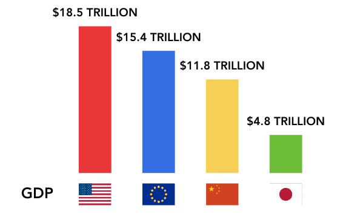

- [Tutorial 2: Contribute Templates](#tutorial-2-contribute-templates)
  - [Create Template](#create-template)
    - [Step 1: Prepare](#step-1-prepare)
    - [Step 2: Declare Target Type](#step-2-declare-target-type)
    - [Step 3: Add *AniUnit*](#step-3-add-aniunit)
    - [Step 4: Add Parameters](#step-4-add-parameters)
  - [Use Template](#use-template)
    - [Step 1: Apply Template](#step-1-apply-template)
    - [Step 2: Add More Details](#step-2-add-more-details)
    - [Step 3: Refine Animation](#step-3-refine-animation)


# Tutorial 2: Contribute Templates

The last tutorial introduces a reproduction of animated infographics, creating a template to animate the bar, bar label, and axis label as a group.
In *Gaia*, animation design for a group (including effects and timing for each element) can be reused not only in the same infographic but also in other infographics.

Now let's try to make this template more general and contribute it as a template for all bar charts.
This template can be shared with others and reuse it in another infographic.

## Create Template

### Step 1: Prepare

Start with the `ShowCateogy` template in the last tutorial, we first simplify the expression of `target`.
In this example, we use the data `xVal` to select different elements, so it works on any bar chart that binds the `xVal`.
You can also use other approaches, such as using *AtTransform* to select elements with a given index.
The result is shown below.

```json5
{
  "name": "ShowCategory",
  "params": {
    "category": { "type": "string" },
    "barLabelOffset": { "value": 1 },
  },
  "main": {
    "sync": [
      {
        "ref": "Wipe",
        "target": ".Bar rect[xVal=$category]",
        "from": "left",
      },
      {
        "ref": "Cut",
        "target": ".AxisLabel text[xVal=$category]"
      },
      {
        "ref": "Cut",
        "target": ".BarLabel text[xVal=$category]",
        "offset": "$barLabelOffset"
      }
    ]
  }
}
```

Notice that the creation of templates can be done without relying on a real infographic instance.
But we can use one for testing and previewing.

*Gaia* uses a **virtual target model** for target selection, so the declaration of `target` works regardless of the actual SVG structure. 
The DOM structure used in selecting is consistent in different infographics, as long as they are declared to be of the same type.

### Step 2: Declare Target Type

Next, we add `targetType` attribute to declare the type of the targeted animation instance.

```json5
{
  "name": "ShowCategory",
  "targetType": "BarChart",
  ...
}
```

The group transferred to this template is specified as `BarChart`.
Now we can know there are `Bar`, `BarLabel`, and `AxisLabel` in the group.

### Step 3: Add *AniUnit*

There are other elements that we hope to animate together, such as `AxisSymbol`. Now we design animations for them by adding *AniUnits*.

```json5
...
"sync": [
  ...
  {
    "ref": "Zoom",
    "target": ".AxisSymbol > *[xVal=$category]",
  },
]
```

If the selection is empty, the animation will be skipped.

### Step 4: Add Parameters

We can add more parameters to make the template more customizable.
Here, we set the effect type of text as parameters (with a default value `Cut`), then expose the `from` parameter of `Wipe`.
The result template spec is:

```json5
{
  "name": "ShowCategory",
  "params": {
    "category": { "type": "string" },
    "barLabelOffset": { "value": 1 },
    "textEffect": { "value": "Cut" },
    "barWipeFrom": { "value": "bottom" },
  },
  "main": {
    "sync": [
      {
        "ref": "Wipe",
        "target": ".Bar rect[xVal=$category]",
        "from": "$barWipeFrom",
      },
      {
        "ref": "$textEffect",
        "target": ".AxisLabel text[xVal=$category]"
      },
      {
        "ref": "Zoom",
        "target": ".AxisSymbol > *[xVal=$category]",  // here we use "> *" because symbol might be a group that contains multiple elements
      },
      {
        "ref": "$textEffect",
        "target": ".BarLabel text[xVal=$category]",
        "offset": "$barLabelOffset"
      },
    ]
  }
}
```


## Use Template

Now we finish the declaration of the template. 
Anyone can use it in all infographics (including the instance in tutorial 1) after registering it to *Gaia*'s library.
Here we try to use it to reproduce a [real animation](https://youtu.be/eBV4GmK4kO4?t=33).

The static SVG with data (shown below) and audio are provided.



### Step 1: Apply Template

In the empty animation spec, insert 4 *AniUnits* to corresponding times.
Remember that you can play and evaluate animations at any time

```json5
 {
  "targetType": "BarChart",
  "main": {
    "sync": [
      {
        "ref": "ShowCategory",
        "category": "USA",
        "offset": 3.7
      },
      {
        "ref": "ShowCategory",
        "category": "China",
        "offset": 7.5
      },
      {
        "ref": "ShowCategory",
        "category": "Japan",
        "offset": 13
      },
      {
        "ref": "ShowCategory",
        "category": "EU",
        "offset": 18
      }
    ]
  }
}
```

### Step 2: Add More Details

We next add two *AniUnits*: `Type` and `MoveFrom`. They are placed at the beginning and before the last category enters, respectively.

```json5
...
"sync": [
  {
    "ref": "Cut",
    "target": ".AxisTitle"
  },
  ...
  {
    "ref": "MoveFrom",
    "target": [
      { "selectAll": ".Bar > *, .BarLabel > *, .XAxis .Symbol > *" },
      { "filter": "@data.xVal == 'China' || @data.xVal == 'Japan'" }
    ],
    "x": "-=128px",
    "offset": 16.5
  },
  ...
]
...
```

### Step 3: Refine Animation

To better reproduce the original animation, we can use the parameters we designed to replace the effect of texts with `Type`.
But if you want to explore the animation settings, it is recommended to use `params` as a place for local variable definition to ease the refinement.

The final animation spec should be like this:

```json5
 {
  "targetType": "BarChart",
  "params": {
    "textEffect": {
      "type": "string",
      "value": "Type"
    },
  }
  "main": {
    "sync": [
      {
        "ref": "Type",
        "target": ".AxisTitle"
      },
      {
        "ref": "ShowCategory",
        "category": "USA",
        "textEffect": "Type",
        "offset": 3.7
      },
      {
        "ref": "ShowCategory",
        "category": "China",
        "textEffect": "Type",
        "offset": 7.5
      },
      {
        "ref": "ShowCategory",
        "category": "Japan",
        "textEffect": "Type",
        "offset": 13
      },
      {
        "ref": "MoveFrom",
        "target": [
          { "selectAll": ".Bar > *, .BarLabel > *, .XAxis .Symbol > *" },
          { "filter": "@data.xVal == 'China' || @data.xVal == 'Japan'" }
        ],
        "x": "-=128px",
        "offset": 16.5
      },
      {
        "ref": "ShowCategory",
        "category": "EU",
        "textEffect": "Type",
        "offset": 18
      }
    ]
  }
}
```

You can still explore other effects and settings to improve the animation.

